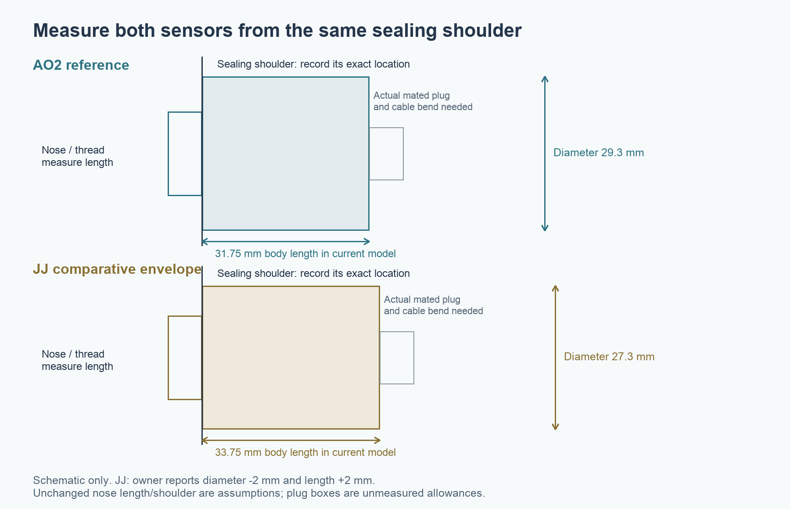

# Mechanical measurements before PCB order and powered assembly

This is the working checklist for **SystemReview**, the separate 85 × 180 × 43 mm enclosure copy. The saved and reopened **v11 native checkpoint** contains the matched routed 0962 PCB, adopted exact M2/M3 inserts and two verified carrier through-openings for its rear components. Final 85/87 mm endpoint, oxygen-variant, material, gas, service and driver checks passed with exact restoration to 85 mm; finished PCB thickness limits were also checked. The [native checkpoint summary](final-local-checkpoint/summary.json) records the digital scope and source bindings. Digital fit checks use the recorded models; a purchased item with an unverified body, plug or seal remains an open interface even when the model clears. Record dimensions in millimetres, the instrument used and a photograph with the mating side visible.

## Measurements already recorded

| Item | Owner measurement or confirmation | Still needed |
|---|---|---|
| Guition display with factory back removed | 69.3 W × 116.8 H × 13.7 D | Exact revision, retained lip/contact geometry, cable exits and connector mating height |
| Occupied protected FMA holder | 42 W × 80.4 H × 20.35 D | Protection-board protrusions, retention details, plug identity/latch and wire exit |
| Cells | Two cells; owner states 3400 mAh each | Maker/model, actual cell dimensions and documented charging limits; capacity statement does not establish a charge profile |
| JJ oxygen sensor relative to AO2 | Same thread; body diameter 2 smaller and length 2 longer | Where the length was measured, shoulder/nose/sealing datums and actual mated cable |
| Guition rear orientation and onboard card slot | Owner photo: UP is image up; horizontal header and two USB sockets at top; SD socket at left | Photo-derived XY is provisional; post/plug Z, card ejection stroke, cable route and service access remain unmeasured |
| Guition bare header depth | Owner measured 13.4 mm from front glass surface to tall header tips | Mated socket height/withdrawal, individual PCB plane and post dimensions remain unmeasured |

The [2026-09-08 photo record](../integration-photo/README.md) corrects the earlier illustrative connector placement. Preserve the v11 checkpoint, but do not reuse its bounded connector clearances as a pass for the newly located hardware. The owner will install a fresh card; use the onboard socket with access behind the rear cover, checking whether display release is necessary for its sideways travel.

The [connector-source review](../integration-photo/connector-candidates.md) now includes actual cable housings. The straight Harwin family reaches up to 16.84 mm above the PCB before wires or withdrawal, so the previous bare-header height allocations do not establish cable fit. This affects intended mates at J401/J501 and the two-position pack-NTC/button headers; J104 remains an open commissioning header. Confirm exact mating parts, including any proposed lower-profile replacement, before revising the PCB or interpreting these dimensions as a harness specification.

## 1. Oxygen sensors and their cables

Measure **both** sensors from the sealing shoulder, rather than from an arbitrary body end. The present JJ model keeps the AO2 shoulder and 6.5 mm nose provisionally, assigning the extra 2 mm to the rear body. The same thread does not confirm either assumption.

- [ ] Photograph the maker/model markings and connector end of AO2 and JJ.
- [ ] Record body diameter; shoulder-to-rear-body length; shoulder-to-nose-tip length; and overall length excluding the detachable cable.
- [ ] Record thread major diameter, pitch, usable engagement length, thread runout and shoulder/sealing-face diameter. The CAD M16 × 1 thread is nominal; confirm the actual fit by hand before relying on it.
- [ ] Identify the actual seal and its mating face. Record seal section, material and supplier compression guidance. No leak-tight face seal or printed thread has been qualified.
- [ ] Identify the J401 plug and confirm the selected Amphenol RF 142138 J402 receptacle and actual 90° JJ plug: part number, gender, PCB mounting pattern and pin assignment.
- [ ] Measure each **mated** connector, cable outside diameter, minimum bend radius, rotation envelope, latch/grip space and disconnect travel. J402 uses an Amphenol 142138 drawing-derived mounting reconstruction; barrel/internal details remain visual references. The actual receptacle and mated 90° plug still require measurement.

J402 remains above J401. Their fixed centres in the current routed-board review are Fusion (54.85, 103.4) and (55.3, 95.54) mm respectively, from KiCad J402 (4.45, 16.6) and J401 (4.9, 24.46). These use X_Fusion = PcbX + x_PCB and Y_Fusion = 120 − y_PCB, with PcbX = 50.4 at the approved 85 mm width. The bare PCB courtyards clear; an actual elbow and plug must also clear the neighbouring connector, button, enclosure and screwdriver paths.

## 2. Bottom USB cartridge

The GCT USB4720-03-A Rev B drawing specifies a 0.60 ± 0.10 mm PCB and a 2.13 mm profile above its top face. The shell centre is 0.50 mm above that face. SystemReview lowers the nominal PCB stack to **Z24.9–25.5**, keeping the port centre at **Z26.0**. The internal ledge and capture pad follow this change; the two mounting screws remain fixed. Rev B places the nose 2.95 mm ahead of the front shell stake: the corrected model uses nose Y0.61 and stake centres Y3.56/7.56, without moving the correct PCB land pattern.

- [ ] Obtain or measure the actual USB4720-03-A. Manufacturer CADENAS download currently requires account sign-in; the native model is a drawing reconstruction.
- [ ] Reconcile nose-to-shell-stake, grounding-tag, SMT-row and PCB notch datums against the Rev B drawing and actual part before ordering the daughterboard.
- [ ] Resolve the existing 0.10 mm copper-to-edge exception against the chosen fabricator's process. A clean DRC with an exception is not fabrication acceptance.
- [ ] Dry fit the real connector on a 0.60 mm board/coupon and insert a real USB-A-to-C and C-to-C cable in both orientations. Check plug overmould, full insertion, shell support and cable bending.
- [ ] Verify the new six-conductor pigtail (power, ground, CC1, CC2, D+ and D−), its solder height, strain relief and bend. The PCB top to bridge underside is 5.7 mm before solder/wire; rear support occupies Y16–18. No mated harness envelope is yet measured.
- [ ] Check both J101 and J902 solder exits. The provisional 6 mm main-board wire allocation does not demonstrate clearance beneath the USB bridge's 5.7 mm gap. Specify actual insulation diameter, bundle shape, bend and disengagement path.
- [ ] Check the printed rear support/capture against the board's finished thickness, solder thickness and actual connector seating. Do not use the screws to force a warped or oversize stack into place.
- [ ] Check insertion/extraction loads and strain relief independently. The uncompressed connector gasket, printed bezel and bezel-to-housing seam do **not** establish an IP rating for the device.

## 3. Gas chamber, humidity, helium and CO modules

- [ ] MD62: photograph markings and all leads; record body dimensions, lead spacing and lengths after forming, insulation and strain relief. Confirm the electrically heated element's actual gas-exposed surfaces and support method.
- [ ] Humidity module: confirm **BME280 or the intended humidity-capable part**, not a BMP280 substitute. Record board outline, holes, component heights, pin order, regulator/pull-up components and cable exit.
- [ ] ZE07-CO: record module revision, PCB outline, header dimensions and orientation, sensor-can height and its exposed face. Its model follows published envelope dimensions; small components and mounting details remain provisional.
- [ ] Select actual gas fittings and tubing: thread/barb, panel engagement, outside/inside diameters, hose bends and disconnection method. Current fitting solids are references.
- [ ] Define the lid perimeter and internal return/baffle seals: real gasket/cord size and material, compression limits, face finish and fastener preload. Flat printed contact alone does not establish a sealed serial flow path.
- [ ] Define an actual sealed electrical feedthrough or documented potting process, with cable diameters and strain relief. The current bore/collar is a provision.
- [ ] Record low-pressure leak tests, flow/pressure, purge and response times at every sensor, temperature/humidity effects and thermal drift. A clear 5 mm CAD route is not a flow-distribution, leak or sensing-accuracy test.

## 4. Display, battery and button interfaces

The approved display service direction is forward. Remove the rear cover, disconnect the battery and remove the upper retainer screw. Withdraw the upper retainer 6 mm rearward (+Z), shift it 1.5 mm in −X, then continue rearward; remove the lower retainer and lift the display through the front (−Z). The staged upper-retainer route was tested on actual transient solids at 85 and 87 mm enclosure widths; straight rearward withdrawal at 87 mm hits the chamber feedthrough. Other removable internal modules use the rear opening. Real wire freedom and hand access still need a physical check. See [the width/service receipt](verification/WIDTH_DATUM_CONTRACT.md).

- [ ] Display: photograph the exact rear connector and retained factory lip; measure corner radii, clamping surfaces and cable exits. Check that the two printed retainers contact the casing, without loading the glass or crushing cables.
- [ ] Holder: measure protrusions and occupied envelope at several points. Identify the plug and mating part; verify polarity from the protected output. Do not bypass the holder's protection.
- [ ] Cells and pack temperature sensor: record actual cell dimensions, holder charging/protection limits, NTC identity/curve and thermal attachment. Keep the electrical commissioning/charge-enable gates in force.
- [ ] Button: record maker/model, barrel thread, flange and nut diameters, nut thickness, washer/seal stack if actually supplied, terminal depth and the mated wire envelope. The current reference does not specify a purchasable button.

## 5. Fasteners, printing and PCB assembly

- [ ] Qualify the adopted **CNC Kitchen TC-M2x3.0**, EAN4262391010013: ten inserts, 3 mm length, Ø3.6 crest and supplier Ø3.2 pilot guidance. The source-bound native update provides nominal 2 mm material beyond the crest at selected support sections. Seven pilots retain their blind floors; the upper PCB and lower display pilots open through the non-gas supports. The lower PCB pilot is **partly open and relieved**: full Ø3.2 clear depth is at least 4.299 mm, exceeding the 4 mm guidance, before a 0.02654 mm² peripheral crescent of the front-opening wall. It is neither a sealed blind floor nor a completely open Ø3.2 exit. Exact supplier CAD is retained unscaled; its internal bore is visual/reference geometry and cannot prove usable M2 thread engagement. Physical retention, thread runout and installation remain pending. See [the native exit measurement](verification/short-m2-implementation/lower-pilot-exit-disposition.json).
- [ ] Qualify the adopted **CNC Kitchen VORON M3×5×4**, EAN4262391010051: four inserts, exact unscaled supplier CAD, Ø4.4 × 5 mm pilots and Ø9 mm bosses. Native geometry retains a complete nominal 2 mm annulus beyond each Ø5 mm crest, the smaller screw-tip relief and at least 0.3476 mm nominal tip clearance. The four retained M3 × 8 button-head screws are generic smooth-shaft references; their explicit overlaps with modeled female-thread crests are confined to the expected engagement region. Nominal M3 × 0.5 identity, 4 mm axial overlap and 3.4 mm central allocation after source chamfers do **not** qualify actual thread class, usable engagement or torque. Confirm the purchased screw identity and mating fit; do not infer an orderable TC code for the insert. See [the native material and interface checks](verification/m3-implementation/width-tests/W85/native-M3-material.json) and [the verified native checkpoint](exact-inserts-checkpoint/native-reopen.json). Preserve all sealed chamber blind holes.
- [ ] Print small insert/fit coupons first in the chosen material and orientation. Qualify the supplier's pilot, installation process, engagement, pull-out/rotation resistance and repeated service before installing inserts in a full enclosure.
- [ ] Match actual screw head/shaft dimensions and length; verify tips do not bottom. Nominal CAD engagement and a clear Ø5 mm tool shaft do not prove torque, handle access or retention strength.
- [ ] Confirm the ordered PCB parts, heights, populated/DNP list, solder-tail envelope, stackup, edge rules and assembly fixture against the source-bound 0962 review. Its matched STEP is installed. The main BOM has 145 purchased component references; the 147 fitted CAD allocations additionally include J101/J102 wire-and-solder envelopes. Keep the board, BOM, height contract and CAD matched if any part or placement changes.
- [ ] Dry fit the final backside components and actual solder against all **three backside-component relief openings**: the existing lower opening at PCB x−0.4–20.525/y83.7–99.7; the shared C103/C107 opening at x11.955–15.795/y77.805–81.595; and the R504 opening at x16.425–20.075/y46.925–49.075. The two new openings pass through the 2 mm plate; exact native checks retain complete 2 mm material rings around them, a 2.105 mm web to the lower opening, one connected carrier and unchanged mounting support. C103/C107/R504 maximum-body-plus-assembly planes are Z19.75/18.90/19.80 respectively, with the nominal PCB back at Z20.5. These source allocations do not measure real solder. No alternate resistor opening at x24.97–27.03/y84.97–88.53 was cut. See [the source-bound carrier proof](verification/final-local-carrier/native-applied.json).
- [ ] Measure finished board thickness and verify screw seating without bowing the board. For the nominal 1.6 mm main board, the current JLCPCB range is 1.44–1.76 mm; the final review includes front component clearance and both M2 clamp/engagement extremes; real seating, solder and board bow still need a sample.
- [ ] Measure the fitted **Samtec HTSW-113-07-L-D header / IDSD-13-S-04.00-G cable** mating assembly and confirm the final omitted-pin7/block7 ordering suffix or keyed accessory. J301 was rotated 180° with its pin map preserved so the standard ribbon exit points inward. The provisional 35 × 5.5 × 12.5 mm mated allocation, inward cable path and ≥6.1 mm axial unmate allowance require the actual sample; the cable length code is overall assembly length, not free ribbon length. Also measure the other selected JST housings, latches and wire exits. See [the source contract](../electrical/host-harness-review/contract.json).
- [ ] Confirm the final SMT assembly process, component standoff, thin USB-board fixture and GCT seating. **SW101 is absent** from the current board; verify probe access to TP1014 on F.Cu at (15.1, 86.4), the QON service pad, and TP1013 on B.Cu at (10.15, 83.9), STAT. Backside probe access may require removing the PCB/carrier assembly. The external device power button remains separate.
- [ ] Keep any later fabricated-part changes matched to a new diagnostic mesh/slicer review. The current P01 housing, P03 carrier, P06 USB frame and P07 chamber passed eight PLA/PETG diagnostic projects and 50 checks, including open carrier apertures and no support entering the protected gas paths. The native 5.50 mm carrier height quantizes to a 5.40 mm deposition top with the tested 0.20 mm layers; this does not establish the actual printed height or fit. See [the source-bound diagnostic receipt](verification/final-local-slices/verification-receipt.json).
- [ ] Use PLA only for an explicitly limited dry-fit prototype. PETG is the current enclosure material target; neither material/process nor chamber sealing, thermal performance or structural loads are qualified.

For each completed item retain: part number and revision, supplier drawing/link, dated photographs, instrument/uncertainty, dimensions, model revision, result and corrective action. Bring-up and powered tests remain in [the electrical checklist](../electrical/measurement-and-bringup.md).
